# FLASH ADC 3-BITS
**Mini_Project VLSI Subject**
Dự án mô phỏng **Flash ADC 3-bit** sử dụng **Cadence Virtuoso**.
Hệ thống gồm các khối: **OR-4, XOR, OPAMP, Encoder và mạch logic**.

---

## 1. Mô Phỏng TopModule
### Schematic TopModule
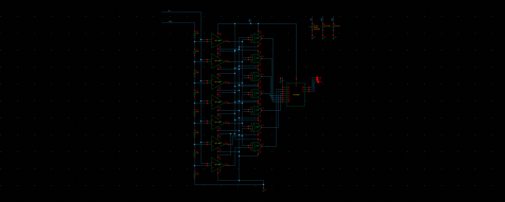
### Symbol TopModule
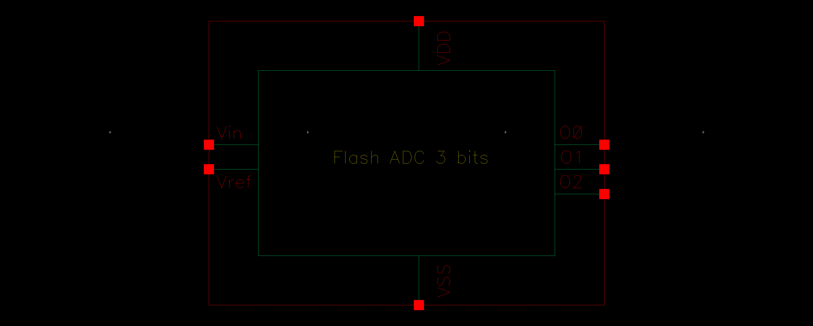
### Simulation TopModule
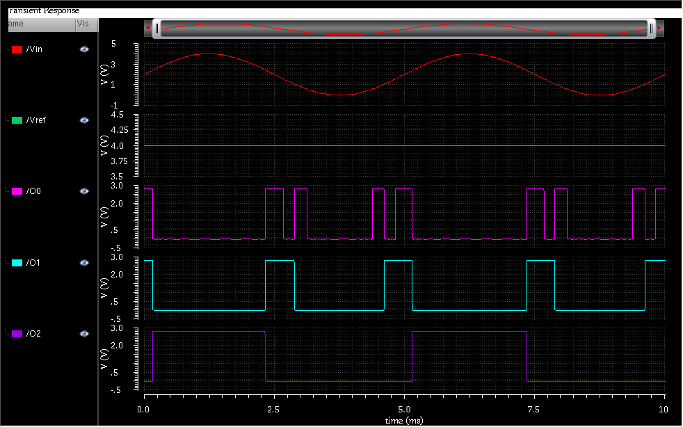

---

## 2. Mô Phỏng Cổng OR-4
### Schematic OR-4
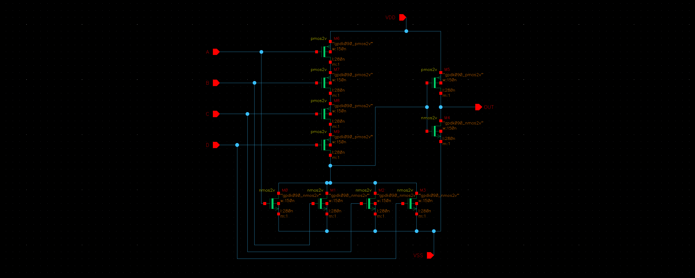
Symbol OR-4
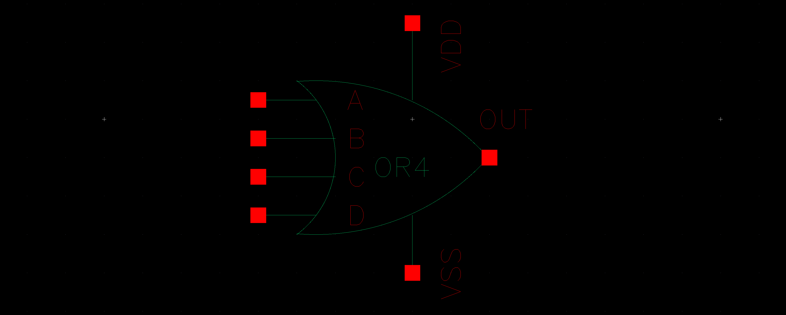

---

## 3. Mô Phỏng Cổng XOR
### Schematic XOR
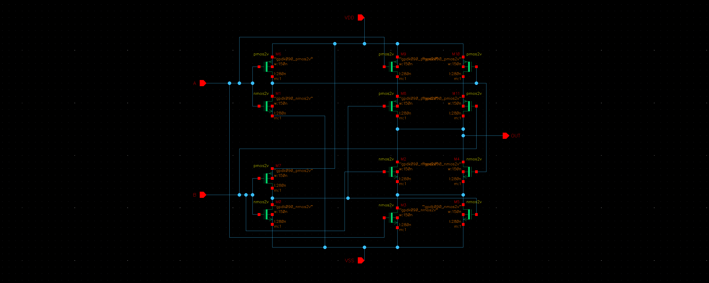
### Symbol XOR
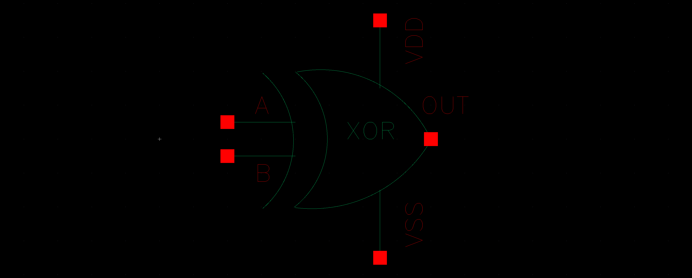

----

## 4. Mô Phỏng Op-Amp
### Schematic Op-Amp
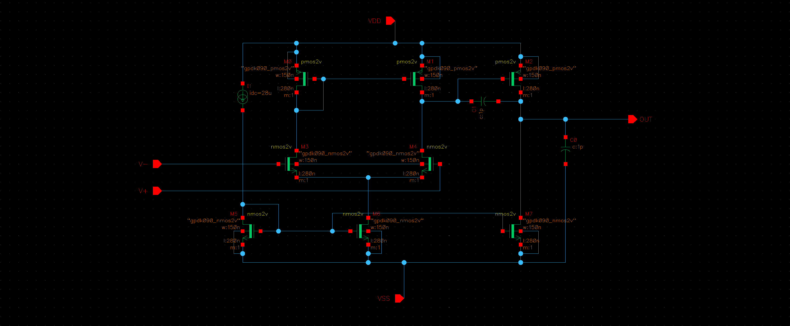
### Symbol Op-Amp
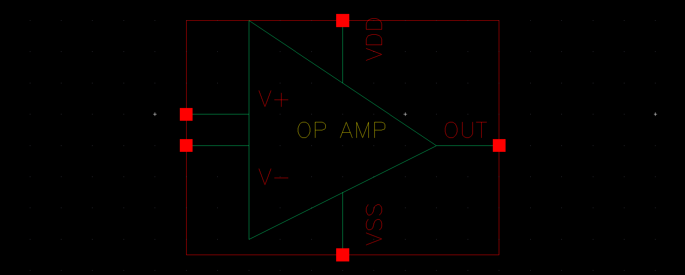
### Simulation Op-Amp

--- 

## 5. Mô Phỏng Encoder
### Bảng sự thật Encoder

Theo tính toán trên lý thuyết ta cần **3 cổng OR 4 ngõ vào** để tạo mạch Encoder
### Schematic Encoder
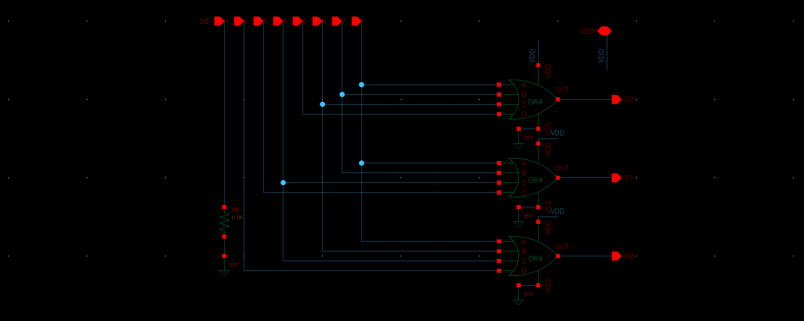
### Symbol Encoder
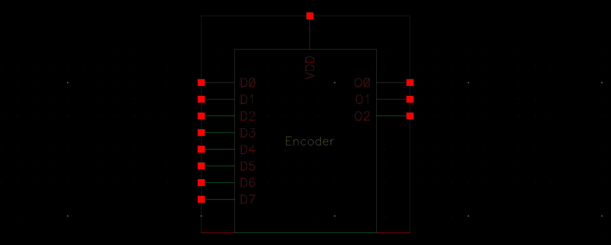
### Simulation Encoder
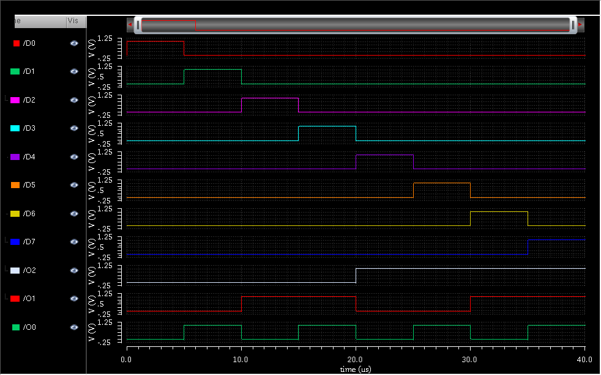

----

## Kết luận
**Flash ADC 3-bit** hoạt động đúng theo lý thuyết.
